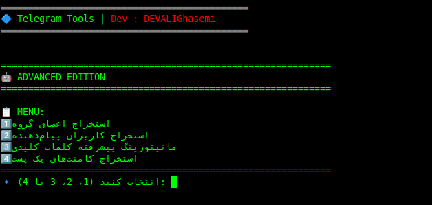

# 🚀 Telegram Advanced Monitoring Tool

## 📌 Overview
This is an advanced Telegram monitoring and data extraction tool built with **Pyrogram**.  
It allows you to analyze chats, extract users, monitor keywords, and collect post comments with high accuracy.

---

## ✨ Features

### 👥 Extract Group Members
- Export all group members (requires admin access)
- Save to Excel file (`members.xlsx`)

### 💬 Extract Message Senders
- Collect users who have sent messages
- Remove duplicates automatically
- Save to Excel (`senders.xlsx`)

### 🔍 Advanced Keyword Monitoring
- Ultra-strong Persian text normalization
- Flexible regex-based keyword matching
- Scan chat history (custom limit or full)
- Save matched results with:
  - User info
  - Message text
  - Direct message link
- Export to Excel (`keyword_results.xlsx`)

### 🧠 Smart Matching System
Handles:
- Persian/Arabic variations
- Repeated characters
- Stylized Unicode text
- Invisible characters

### 🗄 Database System (SQLite)
Stores:
- Messages
- Keywords
- Results
- Last scanned messages

Prevents duplicate processing

### 💬 Extract Post Comments
- Extract all comments from a Telegram post
- Includes replies (nested comments)
- Save to Excel (`post_comments.xlsx`)

### 📊 Excel Export
- Styled headers
- Clickable links
- Auto column width
- Clean formatting

---

## 🛠 Requirements

pip install pyrogram tgcrypto openpyxl

---

## ⚙️ Configuration

Edit in script:

API_ID = YOUR_API_ID  
API_HASH = "YOUR_API_HASH"  
SESSION_NAME = "monitor_session"

Get API credentials from: https://my.telegram.org

---

## ▶️ Usage

python main.py

Then choose:

1 - Extract members  
2 - Extract senders  
3 - Monitor keywords  
4 - Extract post comments  

---

## 📂 Output Files

- members.xlsx → Group members  
- senders.xlsx → Message senders  
- keyword_results.xlsx → Keyword matches  
- post_comments.xlsx → Post comments  
- monitor.db → Database  

---

## ⚠️ Notes

- Admin access required for member extraction  
- Large scans may take time  
- Telegram FloodWait handled automatically  

---

## 📬 Contact  
📧 Email: **devghasemiali@gmail.com**  

---

## 👨‍💻 Developer
DEVALIGhasemi
